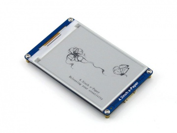

# Waveshare 4.3 inch e-Paper UWP Library #

## What's e-Paper ##

It is [Waveshare's](http://www.waveshare.com "Waveshare") 4.3 inch E-Ink display module,with embedded font libraries(Chinese and English) and 800*600 resolution. It's easy to use with serial interface to control.

它是[微雪电子](http://www.waveshare.net)出品的一个4.3英寸的电子墨水屏模块，具有嵌入式中英文字库和800*600的分辨率。它很容易使用串口来进行控制。

Please refer to the following links for more information about this module:

请参考如下链接以便获得关于此模块更多信息：
* [Product Page](http://www.waveshare.com/4.3inch-e-paper.htm)(English)
* [产品页面](http://www.waveshare.net/shop/4.3inch-e-Paper.htm)(中文)
* [Wiki Page](http://www.waveshare.com/wiki/4.3inch_e-Paper)(English)
* [维基页面](http://www.waveshare.net/wiki/4.3inch_e-Paper)(中文)

## Why UWP ##

UWP, Universal Windows Platform, is Microsoft's morden app platform. You can write your code onece and run it in any Windows devices - PC, tablet, phone, Xbox, HoloLens, Surface Hub and more. This project is written by C#, but you can use it in your project with any language (C++, C#, VB.Net, JavaScript and so on) in UWP app.

UWP, 通用 Windows 平台，是微软现代的应用平台。你可以编写一次代码，在微软的各个Windows平台设备上运行，例如PC, 平板，手机，Xbox, HoloLens, Surface Hub以及更多其他设备。此项目由C#编写，但是您可以在你的UWP项目中使用任何语言（C++, C#, VB.Net, JavaScript等）来调用它.

## How to use ##

### Hardware ###
* [Waveshare 4.3 e-Paper](http://www.waveshare.com/4.3inch-e-paper.htm)
* [USB to TTL adapter](http://www.waveshare.com/product/modules/communication/usb-to-uart-fifo/cp2102-usb-uart-board-type-a.htm) (for PC or IoT devices without UART interface)

### Code ###

    // Please replease the com port with actural name, for Raspberry Pi it will be UART0.
    Waveshare.Devices.Display.ePaper epaper = await ePaper.FromNameAsync('COM1');
    try
    {
        await epaper.DrawLineAsync(Start_X,Start_Y, End_X,End_Y);
    }
    catch (ePaperException ex)
    {
        System.Diagnostics.Debug.WriteLine("Error:" + ex.ePaperExceptionCode.ToString() + "   |  Return->" + ex.CommandResult);
    }
    epaper.Close(); 